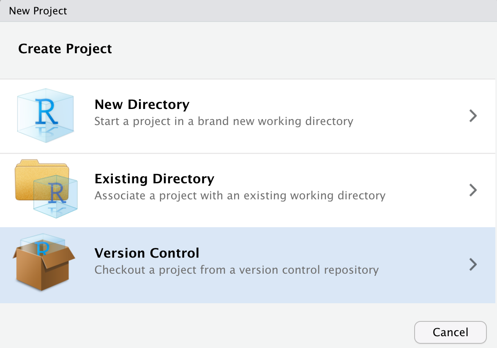
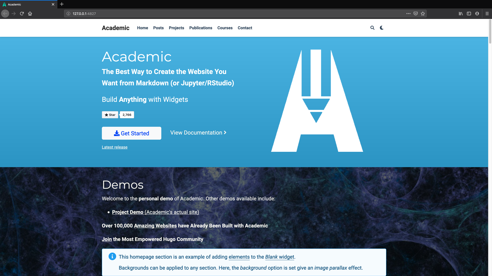

```{r setup, include=FALSE}
options(htmltools.dir.version = FALSE)
knitr::opts_chunk$set(warning = FALSE, message = FALSE, 
  comment = NA, dpi = 300)
library(magick)
library(tidyverse)
```

class: title-slide, top, left
background-image: url(../assets/scott-webb-125443-unsplash.jpg)
background-size: cover

<div class="module mid">
  <h4>`r rmarkdown::metadata$subtitle`</h2>
</div>

# `r rmarkdown::metadata$title`

### `r rmarkdown::metadata$author`


.footnote[

]

---
name: hello
class: inverse, right, middle


# Find me at...

[`r icon::fa("twitter")` @apreshill](http://twitter.com/apreshill)  
[`r icon::fa("github")` @apreshill](http://github.com/apreshill)  
[`r icon::fa("link")` alison.rbind.io](https://alison.rbind.io)  
[`r icon::fa("paper-plane")` alison@rstudio.com](mailto:alison@rstudio.com)


---
name: blogdown
class: inverse, middle, center

# What is blogdown?

---
template: blogdown

```{r out.width="25%", echo = FALSE}
knitr::include_graphics("https://raw.githubusercontent.com/rstudio/hex-stickers/master/PNG/blogdown.png")
```


---
template: blogdown

--

An <i class="fab fa-r-project"></i> package...

--

that lets you create websites in 


???

So what is blogdown?

It is an R package... can I get a show of hands for everyone here who uses R? OK keep them up...

That lets you create websites in RStudio...can I get all of you R users to keep your hand up if you use RStudio, so lower your hand if you don't use RStudio

Perfect, thanks! So this is one of the first perks of blogdown, which is that you can build a website in the RStudio IDE using tools you are familiar with, and you won't need very much else to start.

---


??? 

The package helps you to use a static site generator named Hugo. If you didn't understand much of the last sentence I said, that is OK! The main thing you'll want to know is that Hugo gives you over 100 themes to choose from, so you can create a custom-looking website, in the same way that Wordpress offers website themes.

One difference here is that you own your content, and the entire pipeline for creating it, from start to finish, which I think is a huge benefit to users. You control what, you control when, you control how.


---
class: center, middle

```{r out.width="90%", echo = FALSE}
knitr::include_graphics("../assets/bonus.jpg")
```

--


# .shout[You can use R Markdown!]


???

And a bonus is that because blogdown is built on top of R Markdown, you can include code and output in your website content.

This means you can include R code, but also Python, Julia, C++, any language engine supported in R Markdown.

This makes blogdown ideal for data scientists.

So what does a blogdown site look like?

---
background-image: url(../assets/amber.png)
background-size: contain

---
background-image: url(../assets/openscapes.png)
background-size: contain

---
background-image: url(../assets/earo.png)
background-size: contain

---
background-image: url(../assets/malcolm.png)
background-size: contain

---
background-image: url(../assets/alison.png)
background-size: contain
  
---
background-image: url(../assets/emi-showcase.gif)
background-size: cover


---
class: inverse, middle, center

# `r emo::ji("sparkles")` Quiz! `r emo::ji("sparkles")`

--

For <i class="fab fa-r-project"></i> users, why `blogdown` instead of [WordPress, Tumblr, Medium.com, Blogger.com]?

--

My answers:

+ Own your content
+ Use R Markdown to create content
+ Integrated within RStudio (my happy place)


---
class: inverse, middle

# What does it actually do?

.left-column[

```{r out.width = "50%", echo = FALSE}
knitr::include_graphics("https://gohugo.io/img/hugo.png")
```

]

.right-column[


```{r eval = FALSE}
install_hugo()

hugo_version()

update_hugo() 
```
]

---
class: inverse, middle

# What does it actually do?

.left-column[

```{r out.width = "50%", echo = FALSE}
knitr::include_graphics("https://raw.githubusercontent.com/rstudio/hex-stickers/master/PNG/blogdown.png")
```

]


.right-column[


```{r eval = FALSE}
new_site()

new_content() # via add-in

serve_site() # ditto, via add-in
```


]


---
class: inverse, middle, center

# Let's jump right in!

---
class: middle, center

```{r echo = FALSE, out.width="70%"}
list_png <- c(here::here("assets/flow01-summer-blogdown-github.png"),
              here::here("assets/flow02-summer-blogdown-clone.png"),
              here::here("assets/flow03-summer-blogdown-build.png"),
              here::here("assets/flow04-summer-blogdown-netlify.png"))

list_png %>% 
  map(image_read) %>% # reads each path file
  image_join() %>% # joins image
  image_scale("3000") %>% 
  image_animate(fps = .5)  # animates, can opt for number of loops
```

---
class: inverse, middle, center

# Step 1

--

```{r echo = FALSE, out.width="70%"}
knitr::include_graphics("../assets/flow01-summer-blogdown-github.png")
```


Make a [repo on <i class="fab fa-github fa-lg fa-fw"></i>GitHub](https://happygitwithr.com/new-github-first.html#make-a-repo-on-github-1)

---
class:inverse, middle, center

# Step 2

--

```{r echo = FALSE, out.width="70%"}
knitr::include_graphics("../assets/flow02-summer-blogdown-clone.png")
```

---
class:inverse, middle, center

# Step 2


Make a [new RStudio project via git clone](https://happygitwithr.com/new-github-first.html#new-rstudio-project-via-git-clone) <br>
    *File > New Project > Version Control > Git*

```{r echo = FALSE, out.width='50%'}

```


---
class:inverse, middle, center

# Step 3

--

```{r echo = FALSE, out.width="70%"}
knitr::include_graphics("../assets/flow03-summer-blogdown-build.png")
```


---
class:inverse, middle

.left-column[

# Step 3

]

--

.right-column[

1x per .shout[machine]...


```{r eval = FALSE}
install.packages("blogdown")
```


1x per .shout[work session]...

```{r}
library(blogdown)
```


1x per .shout[project]...

```{r eval = FALSE}
new_site(theme = "gcushen/hugo-academic", 
         sample = TRUE, 
         theme_example = TRUE, 
         empty_dirs = TRUE,
         to_yaml = TRUE)
```

]

---
class:inverse, middle

# Step 3 `r emo::ji("scream")`

https://themes.gohugo.io/academic/

.pull-left[

```{r echo = FALSE}
knitr::include_graphics("../assets/academic-min-version.png")
```

]

--

.pull-right[

```{r eval = FALSE}
hugo_version()
update_hugo(force = TRUE)
```

]


---
class: middle, inverse, center

# Success?

```{r echo = FALSE, out.width="75%"}

```

https://academic-demo.netlify.com/

---
class: inverse, middle, center

# `r emo::ji("sparkles")` Quiz! `r emo::ji("sparkles")`

--

What does the argument `theme = "gcushen/hugo-academic"` do when you call the `new_site()` function? 


--

Hint: https://github.com/gcushen/hugo-academic

---
class: middle, inverse, center

# What just happened?

--

```{r echo = FALSE, out.width="80%"}
list_png <- c(here::here("assets/blogdown-lifecycle/Slide1.png"),
              here::here("assets/blogdown-lifecycle/Slide2.png"),
              here::here("assets/blogdown-lifecycle/Slide3.png"))

list_png %>% 
  map(image_read) %>% # reads each path file
  image_join() %>% # joins image
  image_scale("3000") %>% 
  image_animate(fps = .5)  # animates, can opt for number of loops
```


---
class: inverse, middle, center

# `r emo::ji("sparkles")` Quiz! `r emo::ji("sparkles")`

--

What happens if you edit `public/` directly, or delete the folder altogether, then serve the site again? 


Hint: try it! `r emo::ji("fire")`


---
class:inverse, middle, center

# Step 4

--

```{r echo = FALSE, out.width="70%"}
knitr::include_graphics("../assets/flow04-summer-blogdown-netlify.png")
```


---
class: middle, inverse, center

# Step 4 . . . drop `public/`!

.pull-left[

Go here:

https://app.netlify.com/drop

]

.pull-right[

```{r echo = FALSE}
knitr::include_graphics("../assets/netlify-drop.png")
```

]

---
class: middle, inverse, center

# What just happened?


--

```{r echo = FALSE, out.width = "80%"}
list_png <- c(here::here("assets/blogdown-lifecycle/Slide3.png"),
              here::here("assets/blogdown-lifecycle/Slide5.png"),
              here::here("assets/blogdown-lifecycle/Slide6.png"))

list_png %>% 
  map(image_read) %>% # reads each path file
  image_join() %>% # joins image
  image_scale("2000") %>% 
  image_animate(fps = .5)  # animates, can opt for number of loops
```


---
class: inverse, middle, center

# `r emo::ji("sparkles")` Quiz! `r emo::ji("sparkles")`

--

What happens if you edit `public/` directly, or delete the folder altogether, then serve the site again? 


Hint: try it! `r emo::ji("fire")`

---
class: middle, inverse, center

# Mission accomplished


--

`r emo::ji("graduate")` Used [Hugo](https://gohugo.io/) via the [Academic theme](https://themes.gohugo.io/academic/) to make a website

--

`r emo::ji("computer")` Deployed site from our computer to the INTERNET

---
class: middle, inverse, center

# To Do (on deck for day 02)

--

<i class="fab fa-github fa-lg fa-fw"></i> Use GitHub for version control

--

`r emo::ji("rocket")` Use Netlify for continuous deployment

---
name: homework
class: middle, inverse, center

# What do I need to do before day 02?

Homework on the next few slides...
---

# Do the following with serve site running...

1. Open up the `config.toml` file. Change your site title, then close this file!

1. Go to  `config/_default/params.toml`. Now have some fun! Here are some ideas:
    + change the color theme
    + play with the day/night theme button
    + change the font 
    + ensure that <i class="fab fa-r-project"></i> code is highlighted (check out the "Hello R Markdown" post to see these changes in action)

1. Attempt to update your site (doh!)

More on next slide...

---

# Prepare for tomorrow

1. Find a `.jpg` file you want to use as a profile photo.

1. Look at the default landing page for your current "out of the box" example site- scroll through the sections. Which do you like? Which do you want to cut? Make a list!

1. Look at the upper menu navbar- what menu items do you want? What is missing? Make a list!

Want more?...

---
name: extra

# Extra

1. Use the same `config/_default/params.toml` file to change the code [highlight style](https://cdnjs.com/libraries/highlight.js/)

1. Update your contact info for the contact form

1. For some light reading, check out this "learn x in y minutes" primer on [TOML](https://learnxinyminutes.com/docs/toml/). You probably already know about [YAML](https://learnxinyminutes.com/docs/yaml/) as an R Markdown user- but there are important differences!
