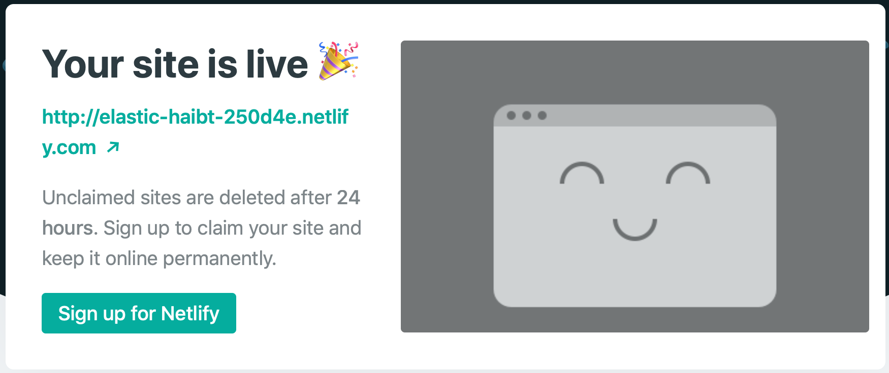
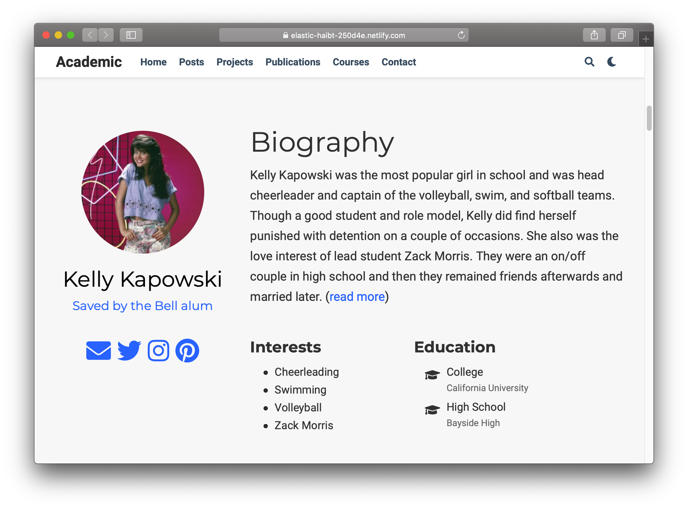
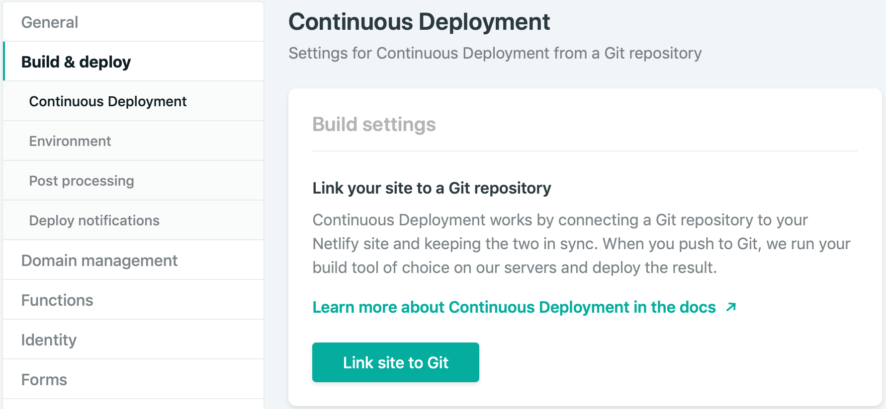

```{r setup, include=FALSE}
options(htmltools.dir.version = FALSE)
knitr::opts_chunk$set(warning = FALSE, message = FALSE, 
  comment = NA, dpi = 300)
library(magick)
library(tidyverse)
library(countdown)
```

class: title-slide, top, left
background-image: url(../assets/etienne-girardet-360034-unsplash.jpg)
background-size: cover

<div class="module mid">
  <h4>`r rmarkdown::metadata$subtitle`</h2>
</div>

# `r rmarkdown::metadata$title`

### `r rmarkdown::metadata$author`


.footnote[

]

---
name: hello
class: inverse, right, middle


# Find me at...

[`r icon::fa("twitter")` @apreshill](http://twitter.com/apreshill)  
[`r icon::fa("github")` @apreshill](http://github.com/apreshill)  
[`r icon::fa("link")` alison.rbind.io](https://alison.rbind.io)  
[`r icon::fa("paper-plane")` alison@rstudio.com](mailto:alison@rstudio.com)


---
class: middle, inverse

# Day 01 review

--

+ Discussed `blogdown` selling points `r emo::ji("bulb")`


--

+ Got to know our Hugo installation `r emo::ji("wave")`

--

+ Used Hugo to build a website in RStudio `r emo::ji("strong")`

--

+ Deployed a website using Netlify `r emo::ji("rocket")`

--

+ Learned that all Hugo themes are GitHub repositories `r emo::ji("woman_shrugging")`

--

+ Learned that when you serve site, R + Hugo = `r emo::ji("dizzy")` -> `public/` (`r emo::ji("x")` TOUCH!)

--

+ Alison mused about the false lure of Hugo theme "simplicity" `r emo::ji("yoga")`


---
class: middle, inverse, center

# Mission not-quite-accomplished


`r emo::ji("graduate")` Used [Hugo](https://gohugo.io/) via the [Academic theme](https://themes.gohugo.io/academic/) to make a website


`r emo::ji("computer")` Deployed site from our computer to the INTERNET

--

<i class="fab fa-github fa-lg fa-fw"></i> Used  GitHub for version control

--

`r emo::ji("rocket")` Used Netlify for continuous deployment

---
class: middle, center

```{r echo = FALSE, out.width="70%"}
list_png <- c("../assets/flow01-summer-blogdown-github.png",
              "../assets/flow02-summer-blogdown-clone.png",
              "../assets/flow03-summer-blogdown-build.png",
              "../assets/flow04-summer-blogdown-netlify.png")

list_png %>% 
  map(image_read) %>% # reads each path file
  image_join() %>% # joins image
  image_scale("3000") %>% 
  image_animate(fps = .5)  # animates, can opt for number of loops
```


---
class:inverse, middle, center

# Step 4

--

```{r echo = FALSE, out.width="70%"}
knitr::include_graphics("../assets/flow04-summer-blogdown-netlify.png")
```

---
class: middle, inverse, center

# Drag & drop deploy


```{r echo = FALSE, out.width = "80%"}
list_png <- c("../assets/blogdown-lifecycle/Slide3.png",
              "../assets/blogdown-lifecycle/Slide5.png",
              "../assets/blogdown-lifecycle/Slide6.png")

list_png %>% 
  map(image_read) %>% # reads each path file
  image_join() %>% # joins image
  image_scale("2000") %>% 
  image_animate(fps = .5)  # animates, can opt for number of loops
```

---
class: middle, inverse, center



https://elastic-haibt-250d4e.netlify.com


---

# Homework review


+ Netlify linked to GitHub?

+ Used the serve site add-in?

+ Edited `content/authors/admin/_index.md`?

+ Added a profile pic?

--

`r emo::ji("point_right")` Have we all said goodbye to <u>Nelson Bighetti</u> (at least locally)?

---
class: middle, inverse, center

```{r echo = FALSE, out.width="70%"}

```

https://elastic-haibt-250d4e.netlify.com

---
class: inverse, middle, center

# `r emo::ji("sparkles")` Quiz! `r emo::ji("sparkles")`

--

What did you notice was painful about updating your site using this method?


---
class: middle, inverse, center

# Now let's automate `r emo::ji("robot")`


---
class: middle, inverse, center

# Step 4 `r emo::ji("rocket")`

```{r echo = FALSE, out.width = "80%"}
list_png <- c("../assets/blogdown-lifecycle/Slide7.png",
              "../assets/blogdown-lifecycle/Slide8.png",
              "../assets/blogdown-lifecycle/Slide9.png")

list_png %>% 
  map(image_read) %>% # reads each path file
  image_join() %>% # joins image
  image_scale("2000") %>% 
  image_animate(fps = .5)  # animates, can opt for number of loops
```

---
class: middle, inverse

# Two more steps 

1. Add a `netlify.toml` file

1. Update `.gitignore` file


---

# netlify.toml file

```{r eval = FALSE}
file.create("netlify.toml")
```

--

Open, then copy & paste:

```js

[build]
  publish = "public"
  command = "hugo"

[context.production.environment]
  HUGO_VERSION = "0.55.6"
  HUGO_ENV = "production"
  HUGO_ENABLEGITINFO = "true"
  
[context.branch-deploy.environment]
  HUGO_VERSION = "0.55.6"
```


---

# .gitignore file

```{r eval = FALSE}
.Rproj.user
.Rhistory
.RData
.Ruserdata
public/ #<<
.DS_Store # if a windows user, Thumbs.db instead
```


---
class: middle, center

# Commit + Push to GitHub

.footnote[Shhh...COMMAND+A then space bar to commit all files]

---
class: middle, center

# Link to GitHub in Netlify

```{r echo = FALSE}

```


---
class: inverse, middle, center


https://app.netlify.com/sites/elastic-haibt-250d4e/deploys

---
class: middle, inverse, center

# Mission accomplished


--

`r emo::ji("graduate")` Used [Hugo](https://gohugo.io/) via the [Academic theme](https://themes.gohugo.io/academic/) to make a website

--

`r emo::ji("computer")` Deployed site from our computer to the INTERNET

--

<i class="fab fa-github fa-lg fa-fw"></i> Used  GitHub for version control

--

`r emo::ji("rocket")` Used Netlify for continuous deployment

---

class: inverse, middle, center

# `r emo::ji("sparkles")` Quiz! `r emo::ji("sparkles")`

--

Using continuous deployment, do you need to serve site before committing to GitHub?


--
<br>
Answer: Yes, because Hugo doesn't understand R Markdown.

Generally: 

`mypost.Rmd` `r emo::ji("arrow_right")` `mypost.html`

`mypost.Rmarkdown` `r emo::ji("arrow_right")` `mypost.md`


---
class: middle, center, inverse

# Personalizing your site

```{r echo = FALSE, out.width='50%'}
knitr::include_graphics("https://upload.wikimedia.org/wikipedia/commons/4/45/Mr._Potato_Head_at_a_poolside.jpg")
```


---

# This is a Hugo site

```{r echo = FALSE}
fs::dir_tree(path = "/Users/alison/rscratch/kellykapowski", recurse = FALSE, all = TRUE)
```

---

# This is the content folder

.pull-left[
```{r echo = FALSE, highlight.output = 8}
fs::dir_tree(path = "/Users/alison/rscratch/kellykapowski", recurse = FALSE, all = TRUE)
```
]

.pull-right[
```{r echo = FALSE}
fs::dir_tree(path = "/Users/alison/rscratch/kellykapowski/content", recurse = FALSE, all = TRUE)
```


+ Hugo calls these "sections"
+ Every section has a "page" (usually singular)
+ See also: the top menu navbar 
]


---

class: inverse, middle, center

# `r emo::ji("sparkles")` Quiz! `r emo::ji("sparkles")`


Do you have to include a blog or posts section in your `blogdown` site?


---
class: inverse, middle, center

# Which content?

I recommend all but `slides`! 

Also, unless doing a team blog, you probably won't need to add any more `authors`.


---
class: middle, center, inverse

# Edit content

Pick any folder *other than in the `home` folder*- edit content and see what changes via **LiveReload**

```{r echo = FALSE}
countdown(minutes = 5, play_sound = TRUE)
```


---

# This is the home folder

.pull-left[
In the academic theme, these are *widgets*:

+ Portable! Move the `widget.md` file to any other [page](https://sourcethemes.com/academic/docs/managing-content/#create-a-widget-page)
+ Configurable! Think: Mr. Potato Head

]

.pull-right[

```{r echo = FALSE}
fs::dir_tree(path = "/Users/alison/rscratch/kellykapowski/content/home", recurse = FALSE, all = TRUE)
```

]

---
class: inverse, middle, center

# Widgets


---
class: inverse, middle, center

# Edit your home page

Pick your widgets- I suggest leaving them all in place but setting `active = FALSE` to remove any.


If you delete, they are always in: `themes/hugo-academic/exampleSite/content/home`

```{r echo = FALSE}
countdown(minutes = 5, play_sound = TRUE)
```


Bonus: move a widget to another [page](https://sourcethemes.com/academic/docs/managing-content/#create-a-widget-page). You could, for example, have the `about.md` widget be the **only** active widget on the home page.


---

# Go Deeper

Read more of the [docs](https://sourcethemes.com/academic/docs/page-builder/#personalizing-widgets) for personalizing widgets.

