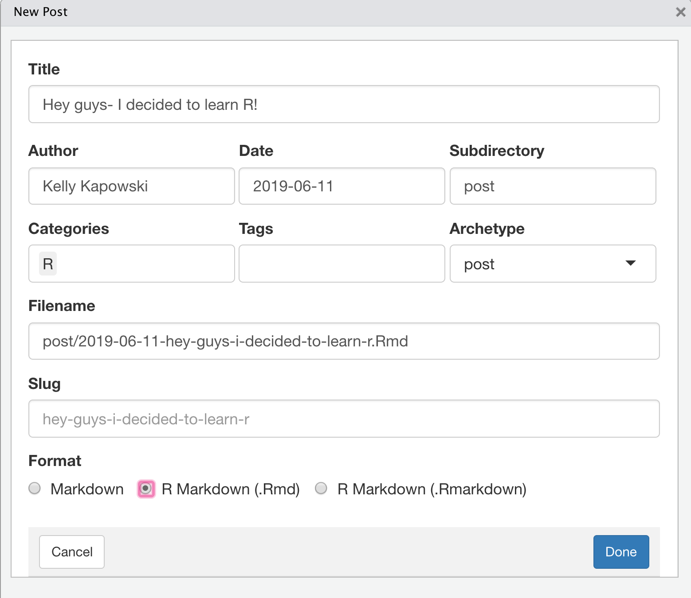

```{r setup, include=FALSE}
options(htmltools.dir.version = FALSE)
knitr::opts_chunk$set(warning = FALSE, message = FALSE, 
  comment = NA, dpi = 300)
library(magick)
library(tidyverse)
library(countdown)
```

class: title-slide, top, left
background-image: url(../assets/edoardo-busti-297725-unsplash.jpg)
background-size: cover

<div class="module mid">
  <h4>`r rmarkdown::metadata$subtitle`</h2>
</div>

# `r rmarkdown::metadata$title`

### `r rmarkdown::metadata$author`


.footnote[

]

---
name: hello
class: inverse, right, middle


# Find me at...

[`r icon::fa("twitter")` @apreshill](http://twitter.com/apreshill)  
[`r icon::fa("github")` @apreshill](http://github.com/apreshill)  
[`r icon::fa("link")` alison.rbind.io](https://alison.rbind.io)  
[`r icon::fa("paper-plane")` alison@rstudio.com](mailto:alison@rstudio.com)


---
class: middle, inverse

# Day 01 review


+ Discussed `blogdown` selling points `r emo::ji("bulb")`


+ Got to know our Hugo installation `r emo::ji("wave")`


+ Used Hugo to build a website in RStudio `r emo::ji("strong")`


+ Deployed a website using Netlify `r emo::ji("rocket")`


+ Learned that all Hugo themes are GitHub repositories `r emo::ji("woman_shrugging")`


+ Learned that when you serve site, R + Hugo = `r emo::ji("dizzy")` -> `public/` (`r emo::ji("x")` TOUCH!)


+ Alison mused about the false lure of Hugo theme "simplicity" `r emo::ji("yoga")`


---

# Day 02 homework review

--

+ the `config.toml`- what changed here? ([docs](https://gohugo.io/getting-started/configuration/#all-configuration-settings))

--

+ `config/_default/params.toml`- what changed here? ([docs](https://gohugo.io/variables/site/#the-site-params-variable))

--

+ `config/_default/menus.toml`- what changed here? ([docs](https://gohugo.io/content-management/menus/#add-non-content-entries-to-a-menu))

---
class: middle, inverse

# Day 02 review

--

+ Used version control via GitHub

--

+ Used continuous deployment via Netlify

--

+ Personalized your `about.md` page (social links, bio, interests, education)

--

+ Practiced making changes, serving site, push to GitHub, + `r emo::ji("boom")` deploy

--

+ Learned a bit about Hugo `content/` `r emo::ji("right_arrow")` sections `r emo::ji("right_arrow")` pages

--

+ Learned a bit about TOML vs YAML `r emo::ji("sweet_potato")`

--

+ Played with turning widgets on and off a la Mr. Potato Head `r emo::ji("potato")`

---
class: inverse, middle, center

# Widgets


---
class: inverse, middle, center

--

# The hard part is not the <i class="fab fa-r-project"></i> part...

---

# Hugo Pages


```
.
├── authors/            # => https://example.com/authors/
├── example/index.md    # => https://example.com/example/
└── home/               # => https://example.com/
```

---

class: inverse, middle

# .center[`r emo::ji("sparkles")` Quiz! `r emo::ji("sparkles")`]

Take a look at two links:

+ My example site for [Kelly Kapowski](https://elastic-haibt-250d4e.netlify.com/)

+ My [content folder](https://github.com/apreshill/kellykapowski/tree/master/content)

Figure out the URL needed to access the content below:

```{r eval = FALSE}
.
├── authors/            # => https://elastic-haibt-250d4e.netlify.com/?
├── authors/jessie.md   # => https://elastic-haibt-250d4e.netlify.com/?
├── authors/kelly.md    # => https://elastic-haibt-250d4e.netlify.com/?
├── authors/lisa.md     # => https://elastic-haibt-250d4e.netlify.com/?
├── book                # => https://elastic-haibt-250d4e.netlify.com/?
├── book/cookbook.md    # => https://elastic-haibt-250d4e.netlify.com/?
└── home/               # => ?
```


```{r echo = FALSE}
countdown(minutes = 5, play_sound = TRUE,
          color_background = "#95C04C",
          color_running_background = "#A9E1BA")
```


---
class: inverse

# Let's chat for 10 minutes! 

In pairs, please view each others' sites-discuss the following and add to the shared google doc:

1. What do you love about your site? (pleased with colors? widgets?)

1. What bugs you about your site? (something you couldn't quite get right?)

1. What do you feel like we have glossed over so far that you really want to know or better understand?

1. After 2 days working on your site, what do you understand now about `blogdown`/Hugo/Netlify that confused you at first?

```{r echo = FALSE}
countdown(minutes = 10, play_sound = TRUE)
```

---
class: inverse, middle, center

# Let's edit some content

---

# Things you probably care about

--

1. Linking within your site to other parts of your site

--

1. Adding images (where does the file go?)

--

1. Adding data (where does the file go?)

---

# Relative internal links

All URLS are relative from where you (not from your project root, sadly).


To go up a level from <i class="fas fa-map-pin"></i>: `../`

---
class: middle, inverse

# Test out relative links

Go into your single `.Rmd` post and try these out:

+ `[text](../seehere)` `r emo::ji("right_arrow")` links to another post 

+ `[text](../../book)` `r emo::ji("right_arrow")` links to other content (not home page) 

+ `[text](../../#about)` `r emo::ji("right_arrow")` links to other content on home page 

+ `[text](../../img/hero-academic.png` `r emo::ji("right_arrow")` links to a file in your `static/` directory 

```{r echo = FALSE}
countdown(minutes = 5, play_sound = TRUE)
```

---

# Adding images

Two ways (to an image in `static/img/`)

--
names: images

.pull-left[

## Way 1: markdown

``

]

--

.pull-right[

## Way 2: `knitr`

```{r echo = TRUE, eval = FALSE}
knitr::include_graphics("../../img/hero-academic.png")
```

]

---
class: middle, center, inverse

# Let's add new content!

---

# Use the new post add-in

```{r echo = FALSE, out.width="50%"}

```


---

# Page bundles

We need to activate page bundles to be less frustrating

https://alison.rbind.io/post/2019-02-21-hugo-page-bundles/

---

# Activate page bundles

```{r eval = FALSE}
library(usethis)
edit_r_profile(scope = "project")
```

Then add this line (make sure new line at end + restart R)...

```{r eval = FALSE}
options(blogdown.new_bundle = TRUE)
```

---


Heck, while we are at it (new line at end! + restart R)...

```{r}
options(blogdown.author = "Kelly Kapowski",
        blogdown.ext = ".Rmd",
        blogdown.subdir = "post",
        blogdown.yaml.empty = TRUE,
        blogdown.new_bundle = TRUE,
        blogdown.title_case = TRUE)

rprofile <- Sys.getenv("R_PROFILE_USER", "~/.Rprofile")

if (file.exists(rprofile)) {
  source(file = rprofile)
}
```

---

# Page Bundles


.pull-left[

## before bundles

```{r eval = FALSE}
content/
├── about
│   ├── index.md
├── post
│   ├── my-post.md
│   └── my-other-post.mD
├── static
│   ├── my-post.jpg
│   └── other-image.png
```

]

.pull-right[

## after bundles

```{r eval = FALSE}
content/
├── about
│   ├── index.md
├── post
│   ├── my-post
│   │   ├── my-post.jpg
│   │   └── index.md
│   └── my-other-post
│   │   ├── other-image.png
│       └── index.md
```

]


